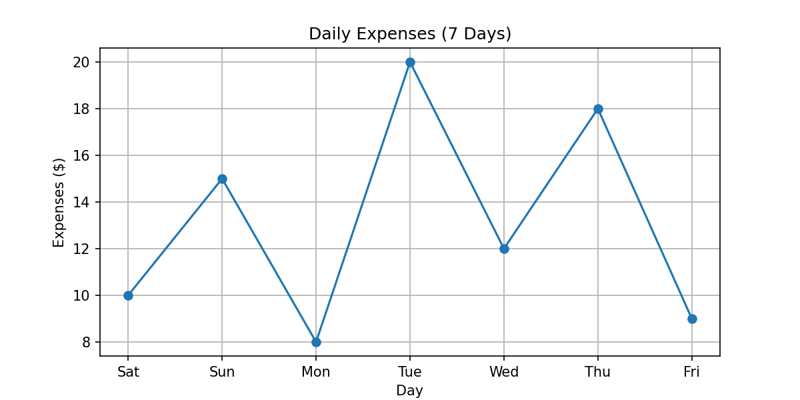
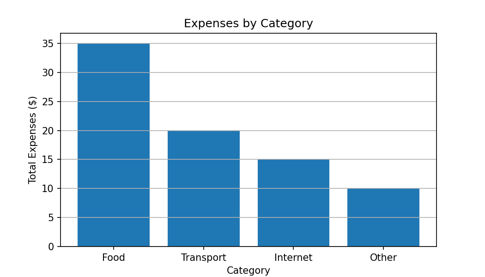

# Day 5 — Matplotlib Basics (Line + Bar)

This lab focuses on creating simple plots using **Matplotlib**:
- Line plot for **7 days expenses**
- Bar chart for **expenses by category**
- Add title + labels + grid
- Save the plots as PNG images

---

## Files
- `notebook.ipynb` → The main Jupyter Notebook (code + outputs)
- `figure_line.png` → Line chart (7 days expenses)
- `figure_bar.png` → Bar chart (expenses by category)

---

## Line Plot — 7 Days Expenses
This plot shows daily expenses during one week.

**Saved output:** `figure_line.png`



---

## Bar Chart — Expenses by Category
This chart compares total expenses across different categories.

**Saved output:** `figure_bar.png`



---

## How to Run
1. Open `notebook.ipynb`
2. Run all cells from top to bottom
3. The notebook will generate and save:
   - `figure_line.png`
   - `figure_bar.png`

---

## Requirements
Install Matplotlib if needed:

```bash
pip install matplotlib
