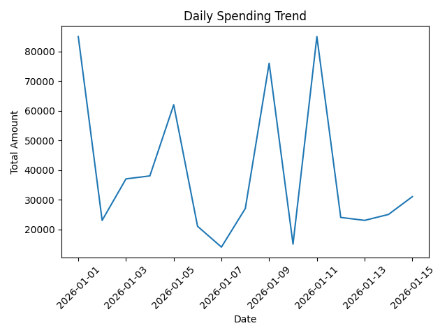
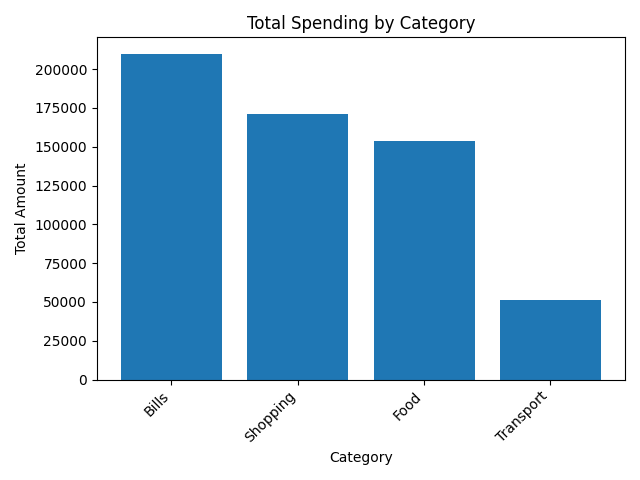
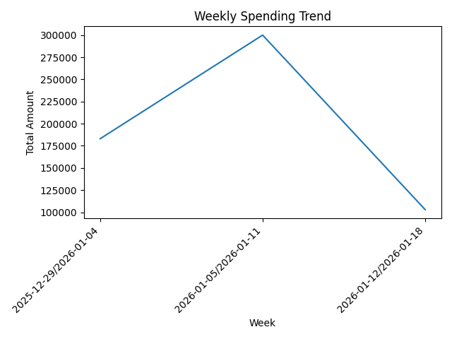
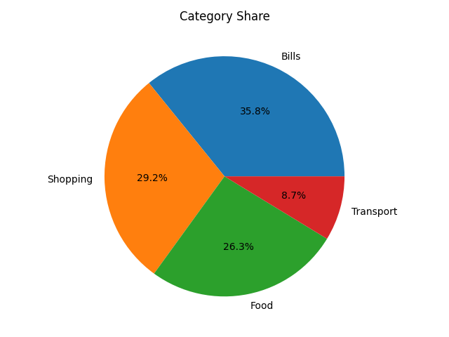

# Week 3 — Day 16: Project Expenses (Clean CSV + Weekly Summary)

This task cleans the raw expenses dataset and produces:
1) A clean dataset (`clean_expenses.csv`)
2) A weekly net summary (`weekly_summary.csv`) using a signed amount approach

---

## Folder Structure

Smart_Expenses_Project/
└─ project/
   ├─ data/
   │  ├─ expenses.csv
   │  └─ clean_expenses.csv
   ├─ reports/
   │  └─ weekly_summary.csv
   └─ src/
      └─ Project_Expenses_cleaning.ipynb

---

## What This Notebook Does

### Cleaning
- Parse `date` into a proper datetime column
- Convert `amount` to numeric
- Handle missing values (fill text fields + drop rows missing `date` or `amount`)

### Feature Engineering
- `day_name`: day of the week
- `week`: week index starting from the first date in the dataset (Week 1, Week 2, ...)
- `is_weekend`: True if the day is Saturday/Sunday
- `signed_amount`: income as positive, expense as negative

### Reporting (Optional but included)
- Generate `weekly_summary.csv` with `net_total` per week

---

## How to Run

Open and run the notebook:

- `project/src/Project_Expenses_cleaning.ipynb`

The notebook reads from:
- `project/data/expenses.csv`

And writes outputs to:
- `project/data/clean_expenses.csv`
- `project/reports/weekly_summary.csv`

---

## Outputs

### 1) clean_expenses.csv
A cleaned dataset ready for analysis and dashboards.

### 2) weekly_summary.csv
A simple weekly net total report:
- `week`
- `net_total`

---

## Notes

- The `week` column is **not ISO week**. It is a **relative week index** starting from the first date in the dataset.
- `signed_amount` rule:
  - income → +amount
  - expense → -amount

------------

# Week 3 — Day 17: Dashboard 1 — Income vs Expense Reports

## Goal
Generate **summary report tables** from the cleaned expenses dataset and save them into a single CSV file.

## Data Source
This dashboard uses the cleaned dataset:
- `project/data/clean_expenses.csv`

## Output (Deliverable)
A single CSV file containing the final report tables:
- `project/reports/summary_tables.csv`

---

## What this task produces

### 1) Income vs Expense (Totals)
A quick comparison of total income and total expense.

### 2) Net Total (Profit/Loss)
A single value showing:
- `net_total = total_income - total_expense`

### 3) Totals by Category
A summary table of totals grouped by `category`
- (You can filter to expenses only, or include both types depending on your design)

### 4) Top 5 Expenses
The five highest expense records (largest amounts).

### 5) Weekly Summary (Mini Challenge)
A weekly totals table (e.g., per week period) for tracking trends over time.

---

## Folder Structure

Smart_Expenses_Project/
└─ project/
   ├─ data/
   │  └─ clean_expenses.csv
   ├─ reports/
   │  ├─ weekly_summary.csv          (from Day 16)
   │  └─ summary_tables.csv          (this task)
   └─ src/
      └─ (your notebook/script)

---

## Notes
- This dashboard is built on **clean_expenses.csv** (not the raw file).
- Keep the output file name stable (`summary_tables.csv`) for consistency and GitHub tracking.
- If your categories contain extra spaces, trimming them before grouping improves results.

## Checklist
- [ ] Generated final summary tables
- [ ] Saved output to `project/reports/summary_tables.csv`
- [ ] Verified the file opens correctly and contains all required sections
- [ ] Committed and pushed changes to GitHub

------------

# Week 3 — Day 18: Dashboard 2 (Plots + README)

This task creates reporting charts from the cleaned dataset and saves them as images:
1) Daily spending trend (line)
2) Spending by category (bar)
3) Weekly spending trend (line)
4) Category share (pie) — optional

---

## Folder Structure (Updated)

Smart_Expenses_Project/
└─ project/
   ├─ data/
   │  ├─ expenses.csv
   │  └─ clean_expenses.csv
   ├─ reports/
   │  └─ weekly_summary.csv
   ├─ plots/
   │  ├─ daily_line.png
   │  ├─ category_bar.png
   │  ├─ weekly_trend.png
   │  └─ category_pie.png   (optional)
   └─ src/
      ├─ Project_Expenses_cleaning.ipynb
      └─ dashboard2_plots.ipynb

---

## Data Source
The notebook reads from:
- `project/data/clean_expenses.csv`

---

## Plots

### 1) Daily spending trend (Line)
Shows total spending per day.

### 2) Spending by category (Bar)
Compares total spending across categories.

### 3) Weekly spending trend (Line)
Shows total spending per week.

### 4) Category share (Pie — optional)
Shows each category as a percentage of total spending.

---

## How to Run
Open and run:
- `project/src/dashboard2_plots.ipynb`

Outputs are saved to:
- `project/plots/*.png`

---

## Notes
- Plots are generated from the **cleaned** dataset, not the raw CSV.
- If image links don’t render on GitHub, make sure the filenames in `plots/` match the README exactly.

--------------------

# Week 3 — Day 19: Forecast 1 (Baseline)

This task builds a simple baseline forecast for the next week using weekly aggregation and a single feature (`week_index`).  
It trains a **LinearRegression** model, evaluates it, then predicts the **next week total**.

---

## Folder Structure

Smart_Expenses_Project/
└─ project/
   ├─ data/
   │  └─ clean_expenses.csv
   ├─ reports/
   │  └─ forecast_next_week.csv
   └─ ml/
      └─ forecast.ipynb

---

## Input

- `data/clean_expenses.csv`
- Required columns:
  - `date`
  - `signed_amount` (income = positive, expense = negative)

---

## Steps

1) Aggregate transactions to weekly totals (`weekly_total`)
2) Create a simple feature: `week_index` (0..N-1)
3) Train a `LinearRegression` model
4) Evaluate using a time-based split (last 1–2 weeks as test)
5) Forecast the next week total

---

## Output

- `reports/forecast_next_week.csv`
  - `next_week_start`
  - `forecast_weekly_total`

---

## How to Run

Open the notebook:

- `project/ml/forecast.ipynb`

Run cells from top to bottom.

---

## Notes

- This is a **baseline** model, so results depend on how many weeks you have.
- For better accuracy later, add more features (month, rolling mean, seasonality) or use time-series models.
